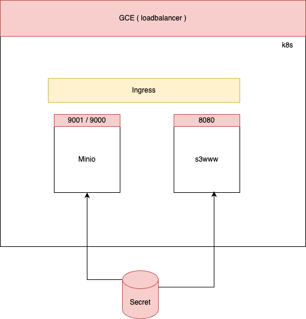

# Minio and s3www Deployment 




This project provides a Helm-based deployment of Minio (S3-compatible object storage) and s3www (S3 web interface). The deployment includes automatic metrics collection, secure credential management, and external access through native Ingress controller.

## Table of Contents
- [Architecture](#architecture)
- [Prerequisites](#prerequisites)
- [Components](#components)
- [Installation](#installation)
- [Configuration](#configuration)
- [Security](#security)
- [Monitoring](#monitoring)
- [Maintenance](#maintenance)
- [Troubleshooting](#troubleshooting)
- [Development](#development)

## Architecture

The solution consists of the following components:

1. **Minio**: S3-compatible object storage server
   - Exposes API on port 9000
   - Exposes Console on port 9001
   - Uses persistent storage for data
   - Exposes Prometheus metrics

2. **s3www**: Web interface for S3 buckets
   - Exposes web interface on port 8080
   - Connects to Minio for data access
   - Exposes Prometheus metrics


## Prerequisites

- `Docker Desktop` with Minikube installed
- `kubectl` installed and configured
- `helm` installed


## Components

### Directory Structure
```
.
├── minio/
│   └── chart/
│       └── minio/
│           ├── templates/
│           │   ├── deployment.yaml
│           │   ├── ingress.yaml
│           │   ├── pvc.yaml
│           │   ├── secret.yaml
│           │   ├── servicemonitor.yaml
│           │   └── service.yaml
│           └── values.yaml
├── s3www/
│   └── chart/
│       └── s3www/
│           ├── templates/
│           │   ├── deployment.yaml
│           │   ├── ingress.yaml
│           │   ├── secret.yaml
│           │   ├── servicemonitor.yaml
│           │   └── service.yaml
│           └── values.yaml
└── terraform/
    ├── main.tf
    └── variables.tf
```

### Helm Charts

#### Minio Chart
- **Deployment**: Configures Minio server with persistent storage
- **Service**: Exposes Minio API and Console
- **Ingress**: Configures GCP Ingress for external access
- **ServiceMonitor**: Configures Prometheus metrics collection
- **Secret**: Manages Minio credentials

#### s3www Chart
- **Deployment**: Configures s3www web interface
- **Service**: Exposes web interface
- **Ingress**: Configures GCP Ingress for external access
- **ServiceMonitor**: Configures Prometheus metrics collection
- **Secret**: Manages S3 credentials

### Terraform Configuration
- Manages helm chart deployment
- Configures Secret Manager
- Sets up Ingress resources
- Manages SSL certificates

## Installation

Terraform is already doing the major work, however, if there is a need to setup the service on minikube, please start from step (2)

1. **Initialize Terraform**:
```bash
cd terraform
terraform init
terraform plan
terraform apply
```

2. **Install Helm Charts**:
```bash
# Install Minio locally
helm install minio ./minio/chart/minio \
  --set ingress.hosts[0].host=minio.example.com \
  --set minio.rootUser=ROOTUSER \
  --set minio.rootPassword=ROOTPASSWORD

# Install s3www locally
helm install s3www ./s3www/chart/s3www \
  --set ingress.hosts[0].host=s3www.example.com \
  --set s3www.accessKey="ACCESS_KEY" \
  --set s3www.secretKey="SECRET_KEYS"
```

## Configuration

### Minio Configuration
```yaml
service:
  type: ClusterIP
  apiPort: 9000
  consolePort: 9001

ingress:
  enabled: true
  className: "gce"
  annotations:
    kubernetes.io/ingress.class: "gce"
    kubernetes.io/ingress.global-static-ip-name: "minio-static-ip"
    networking.gke.io/managed-certificates: "minio-cert"
    kubernetes.io/ingress.allow-http: "false"

metrics:
  enabled: true
  serviceMonitor:
    enabled: true
    interval: 15s
```

### s3www Configuration
```yaml
service:
  type: ClusterIP
  port: 8080

ingress:
  enabled: true
  className: "gce"
  annotations:
    kubernetes.io/ingress.class: "gce"
    kubernetes.io/ingress.global-static-ip-name: "s3www-static-ip"
    networking.gke.io/managed-certificates: "s3www-cert"
    kubernetes.io/ingress.allow-http: "false"

metrics:
  enabled: true
  serviceMonitor:
    enabled: true
    interval: 15s
```


## Monitoring

### Metrics
- Minio metrics available at `/minio/v2/metrics/cluster`
- s3www metrics available at `/metrics`
- Prometheus ServiceMonitors configured
- Custom dashboards available

### Alerts
- Disk usage alerts
- API latency alerts
- Error rate monitoring
- Availability monitoring


## Maintenance


### Backup
- Regular volume snapshots
- Cross-region replication
- Point-in-time recovery

### Scaling
- Horizontal Pod Autoscaling configured
- Resource limits and requests set
- Node pool autoscaling enabled

## Troubleshooting

### Common Issues

1. **Metrics not collected**
   - Verify Prometheus configuration
   - Check ServiceMonitor labels
   - Verify metrics endpoints

2. **Storage issues**
   - Check PVC status
   - Verify storage class
   - Check node disk space

### Logs
```bash
# Minio logs
kubectl logs -l app.kubernetes.io/name=minio

# s3www logs
kubectl logs -l app.kubernetes.io/name=s3www
```

## Development

### Local Development
1. Install minikube
2. Configure local DNS
3. Use local values file


